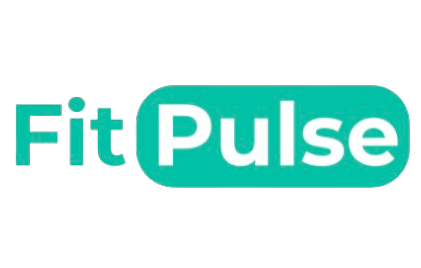
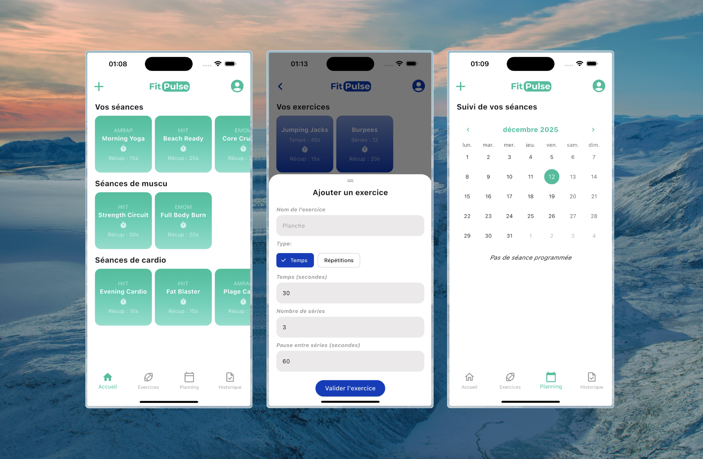

<div align='center'>

  [](.)

  # Fitpulse Project

  It's a mobile application that lets you create your own training programs, built with [Flutter](https://flutter.dev). 

  [](https://flutter.dev)

  [](https://dart.dev) 
  [](https://www.apple.com/fr/swift)

  [Contributors](#-contributors) • [Description](#-description) • [How To Use](#-how-to-use) • [Key Features](#-key-features) • [Credits](#-credits) • [Support](#-support) • [License](#-license)

  

</div>

<div>
    
  ## 👨‍🎓 Contributors

  

  ## 📚 Description 

  The project consists of the creation of a mobile application dedicated to personalised fitness training. The objective of this application is to allow users to easily create, organise and follow their own workout sessions. Users can compose fully customised training sessions by adding exercises, each of which can include specific timing, rest periods or repetitions.

  The application also offers pre-recorded training programmes to help users get started quickly, while maintaining the flexibility of editing or creating new sessions. All data is stored locally on the device, ensuring fast access and offline availability. 

  A planning system allows users to schedule their workouts over the month and by day, giving them a clear and organised view of their upcoming sessions. When it is time to train, the user can launch a session using an integrated workout player including a timer and tools to follow the routine step by step.

## 🚀 How To Use

  To clone and run this application, you'll need [Git](https://git-scm.com) (which comes with [npm](https://www.npmjs.com)) installed on your computer. From your command line:

  ```bash
  # Clone this repository
  $ git clone https://github.com/thomaspsl/fitpulse-app

  # Go into the repository
  $ cd fitpulse-app
  
  # Install dependencies
  $ flutter pub get
  
  # Run the app
  $ flutter run lib/main.dart
  ```

  ## 🔑 Key Features

  You can find the specifications for this project [here](https://www.figma.com/design/wmqBZO5EqlLnKpeO8Xv3IL/FitPulse?node-id=0-1&p=f&t=Mv59OQTzDyeZMFnZ-0).

  ## ✨ Credits

  [](https://pub.dev/packages/table_calendar)
  [](https://pub.dev/packages/flutter_colorpicker)
  [](https://pub.dev/packages/sqflite)
  

  ## 💸 Support

  [](https://www.patreon.com)
  [](https://www.paypal.com)

  ## 🔒 License

  MIT

</div>

<div align='center'>  
  
  Instagram [@thomaspssl](https://www.instagram.com/thomaspssl) • GitHub [@thomaspsl](https://github.com/thomaspsl) • Twitter [@thomaspssl](https://twitter.com/thomaspssl)
  
</div>
